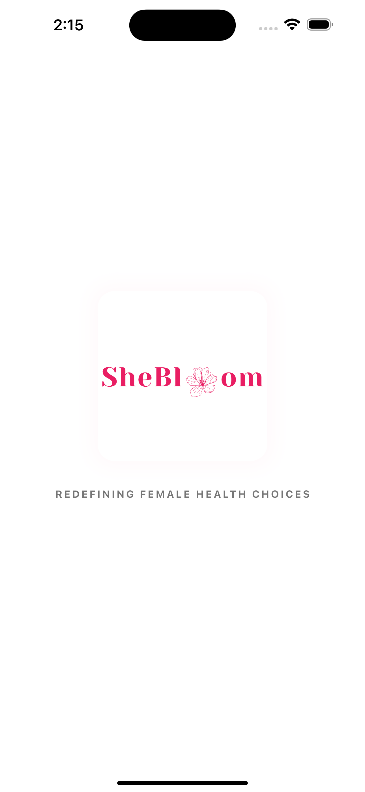
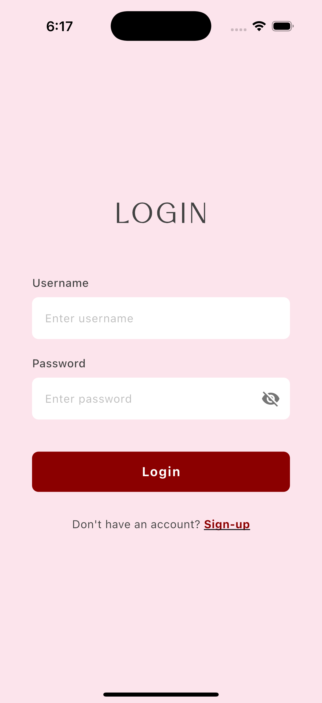
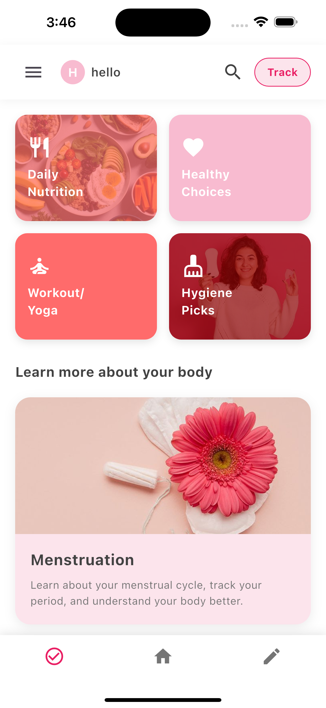
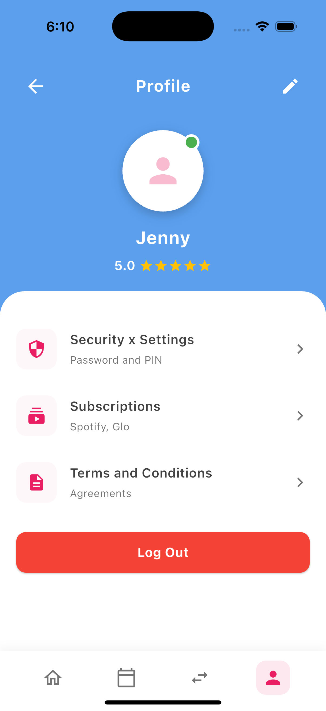
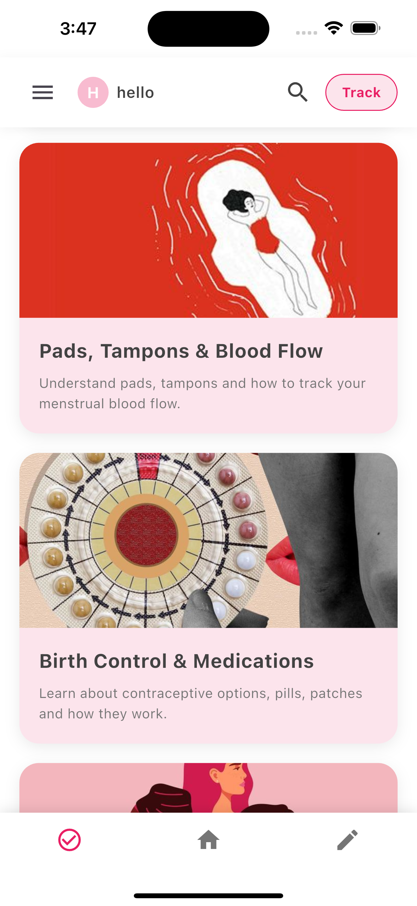

# 🌸 SheBloom - Women's Health & Wellness App

> Redefining Female Health Choices

[](https://flutter.dev)
[](https://firebase.google.com)
[](https://dart.dev)
[](LICENSE)

## 📱 About

SheBloom is a comprehensive women's health and wellness mobile application designed to empower women with knowledge, tracking tools, and resources for their health journey. From menstrual cycle tracking to nutrition guidance, SheBloom is your personal health companion.

## ✨ Features

### 🔐 Authentication
- User registration with email verification
- Secure login with Firebase Authentication
- Password recovery
- Profile management

### 🏠 Home Dashboard
- Daily Nutrition tracking
- Healthy Choices recommendations
- Workout/Yoga routines
- Hygiene tips and products

### 📚 Educational Content
- **Menstruation** - Cycle tracking and education
- **Pads, Tampons & Blood Flow** - Product guides
- **Birth Control & Medications** - Comprehensive information
- **Breast Health** - Awareness and screening
- **Fertility & Pregnancy** - Journey guidance
- **PCOS/PCOD** - Management and support
- **Mental Health** - Wellness and self-care
- **Safe Intimacy Practices** - Health and safety
- **Menstrual Cramps & Relief** - Pain management
- **HPV & Vaccination** - Prevention information
- **Health Screenings** - Check-up reminders
- **Reproductive Health** - Complete guide

### 👤 User Profile
- Personal information management
- Security settings
- Subscription management
- Terms and conditions
- Logout functionality

## 🛠️ Tech Stack

### Frontend
- **Framework:** Flutter 3.x
- **Language:** Dart 3.x
- **State Management:** setState (built-in)
- **UI Components:** Material Design 3

### Backend (Current)
- **Authentication:** Firebase Authentication
- **Database:** Cloud Firestore
- **Cloud Functions:** Firebase Cloud Functions (planned)

### Backend (Future)
- **API:** Node.js + Express.js (planned)
- **Database:** MongoDB/PostgreSQL (planned)
- **Architecture:** RESTful API (planned)

### Additional Packages
```yaml
dependencies:
  firebase_core: ^2.24.2
  firebase_auth: ^4.16.0
  cloud_firestore: ^4.14.0
  flutter_svg: ^2.0.9
```

## 📂 Project Structure

```
lib/
├── main.dart                      # App entry point
├── firebase_options.dart          # Firebase configuration
├── constants/
│   └── colors.dart               # App color palette
├── services/
│   └── auth_service.dart         # Authentication service
├── widgets/
│   ├── category_card.dart        # Reusable category card
│   └── info_card.dart            # Reusable info card
└── screens/
    ├── splash_screen.dart        # Splash/Loading screen
    ├── login_screen.dart         # User login
    ├── signup_screen.dart        # User registration
    ├── home_screen.dart          # Main dashboard
    ├── daily_nutrition_screen.dart  # Nutrition details
    └── profile_screen.dart       # User profile
```

## 🚀 Getting Started

### Prerequisites
- Flutter SDK (3.x or higher)
- Dart SDK (3.x or higher)
- Android Studio / VS Code
- Firebase account
- Git

### Installation

1. **Clone the repository**
   ```bash
   git clone https://github.com/jenny1903/shebloom.git
   cd shebloom
   ```

2. **Install dependencies**
   ```bash
   flutter pub get
   ```

3. **Firebase Setup**

This app requires Firebase configuration. To set up:

### Method 1: Using FlutterFire CLI (Recommended)

1. Install FlutterFire CLI:
```bash
   dart pub global activate flutterfire_cli
```

2. Configure Firebase:
```bash
   flutterfire configure
```

3. This generates:
   - `lib/firebase_options.dart`
   - `android/app/google-services.json`
   - `ios/Runner/GoogleService-Info.plist`

### Method 2: Manual Setup

1. Create a Firebase project at [Firebase Console](https://console.firebase.google.com/)
2. Add Android and iOS apps
3. Download and place configuration files as shown above
4. Enable Authentication and Firestore in Firebase Console

### Run the app
```bash
flutter pub get
flutter run
```

**Note:** Firebase configuration files are excluded from version control for security.

4. **Add Assets**
   - Place your images in `assets/images/`
   - Place your SVGs in `assets/` folder
   - Update `pubspec.yaml` if needed

5. **Run the app**
   ```bash
   # For Android
   flutter run -d android
   
   # For iOS (Mac only)
   flutter run -d ios
   ```

## 🔧 Configuration

### Firebase Setup
1. Create a Firebase project at [console.firebase.google.com](https://console.firebase.google.com)
2. Enable Authentication (Email/Password)
3. Create Firestore Database (start in test mode)
4. Run `flutterfire configure` in project root

### Environment Variables
Create `firebase_options.dart` using FlutterFire CLI (auto-generated)

## 📱 Screenshots

| Splash Screen | Login | Home Dashboard                |
|---------------|-------|-------------------------------|
|  |  |  |

| Profile | Nutrition | Info Cards |
|---------|-----------|------------|
|  |  |  |

## 🗺️ Roadmap

### Phase 1: Foundation ✅
- [x] User authentication (Firebase)
- [x] Home dashboard with category cards
- [x] Profile screen with logout
- [x] Educational content cards
- [x] Daily nutrition detail screen

### Phase 2: Core Features (In Progress)
- [x] Period cycle tracker with calendar
- [x] Symptom logger
- [x] Mood tracker Health reminders/notifications
- [ ] Data visualization (charts/graphs)

### Phase 3: Backend Migration (Planned)
- [ ] Node.js + Express.js API
- [ ] MongoDB integration
- [ ] RESTful endpoints
- [ ] JWT authentication
- [ ] API documentation (Swagger)

### Phase 4: Advanced Features (Future)
- [ ] AI-powered health insights
- [ ] Personalized recommendations
- [ ] Community forum
- [ ] Expert consultation booking
- [ ] Multi-language support
- [ ] Offline mode
- [ ] Data export (PDF reports)

## 🧪 Testing

```bash
# Run all tests
flutter test

# Run specific test file
flutter test test/widget_test.dart

# Run with coverage
flutter test --coverage
```

## 🤝 Contributing

Contributions are welcome! Please follow these steps:

1. Fork the project
2. Create your feature branch (`git checkout -b feature/AmazingFeature`)
3. Commit your changes (`git commit -m 'Add some AmazingFeature'`)
4. Push to the branch (`git push origin feature/AmazingFeature`)
5. Open a Pull Request

### Code Style
- Follow [Effective Dart](https://dart.dev/guides/language/effective-dart) guidelines
- Use meaningful variable/function names
- Add comments for complex logic
- Keep widgets small and reusable

## Firebase Setup for Contributors

1. Create your own Firebase project
2. Copy `firebase_options.dart.example` to `firebase_options.dart`
3. Replace placeholders with your Firebase config
4. Run `flutterfire configure` (recommended) or manually add config

## 📄 License

This project is licensed under the MIT License - see the [LICENSE](LICENSE) file for details.

## 👩‍💻 Author

**Stuti Patel**
- GitHub: [@Jenny1903](https://github.com/Jenny1903)
- LinkedIn: [Stuti Patel](https://linkedin.com/in/patelstutii)
- Email: jennyberry1330@gmail.com

## 🙏 Acknowledgments

- [Flutter Team](https://flutter.dev) for the amazing framework
- [Firebase](https://firebase.google.com) for backend services
- [Figma](https://figma.com) for design inspiration
- All contributors and supporters

## 📞 Support

For support, email jennyberry1330@gmail.com 

## 🌟 Star History

If you find this project useful, please consider giving it a star ⭐

---

**Made with 💕 by [Jenny]**

*Empowering women through technology*